<div align="center">

# 🍽️ Canteen App

**A student canteen booking app for Android, iOS and Web — one Flutter codebase, powered by Firebase.**

[](https://flutter.dev)
[](https://firebase.google.com)
[](#)
[](https://canteen-app-72a86.web.app)

**🌐 [Live Web App](https://canteen-app-72a86.web.app)** · **📱 [Download APK](https://github.com/abhishekghz/canteen-app/releases/latest)** · **📘 [User Guide (PDF)](https://github.com/abhishekghz/canteen-app/releases/latest)**

</div>

---

## Overview

Students register, browse the weekly menu, and book **Breakfast / Lunch / Dinner** with chargeable extras (extra roti, extra sabji), optional packing, **snacks** (two daily slots with book‑now or early booking), and prepaid **coupons** — then pay (payment gateway stubbed for now). A pre‑seeded **admin** manages the menu, all charges, snack slots, and payment status.

> **Admin login:** `admin@canteen.app` / `admin123` &nbsp;·&nbsp; Students create their own account from the login screen.

---

## 📸 Screenshots

### Student

<table>
  <tr>
    <td align="center">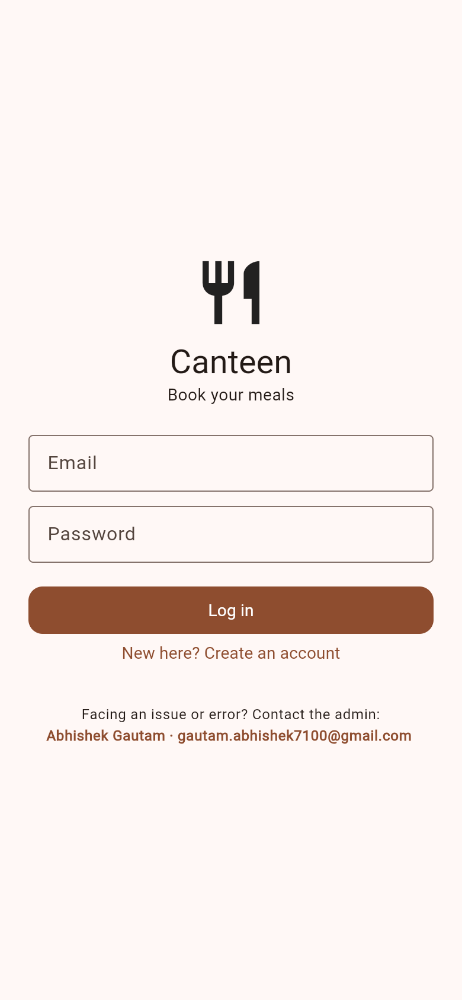<br/><sub><b>Login / Register</b></sub></td>
    <td align="center">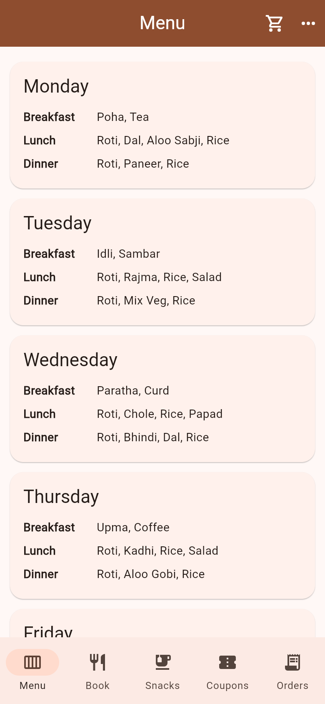<br/><sub><b>Weekly Menu</b></sub></td>
    <td align="center">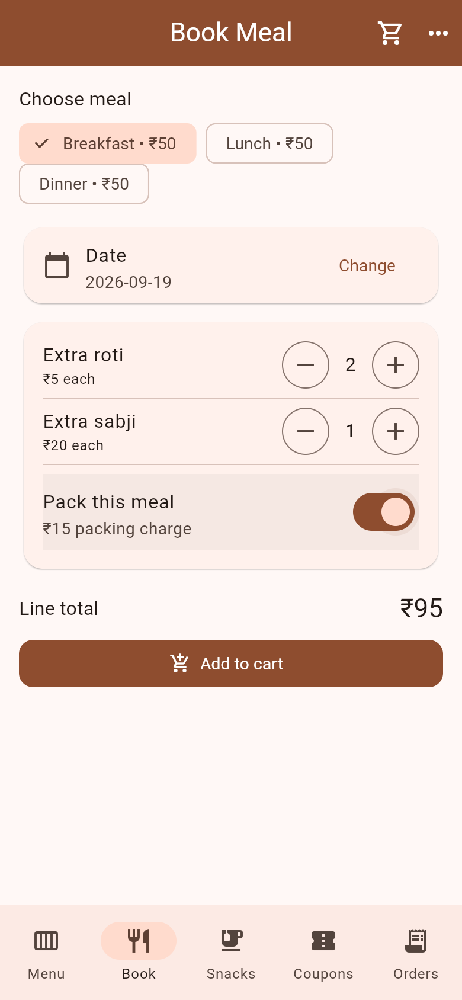<br/><sub><b>Book Meal + Extras</b></sub></td>
    <td align="center">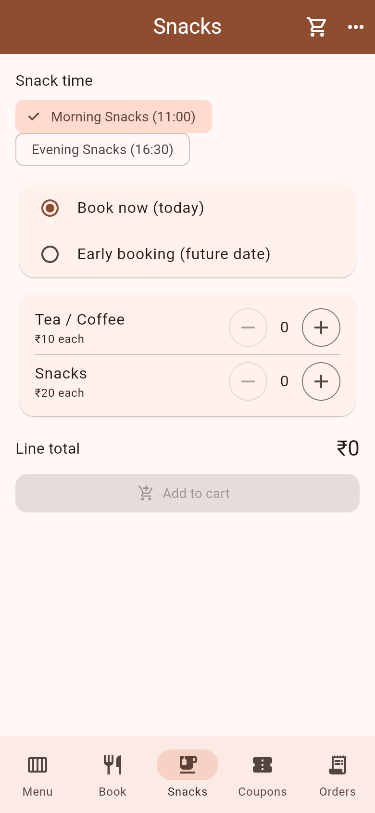<br/><sub><b>Snacks</b></sub></td>
  </tr>
  <tr>
    <td align="center">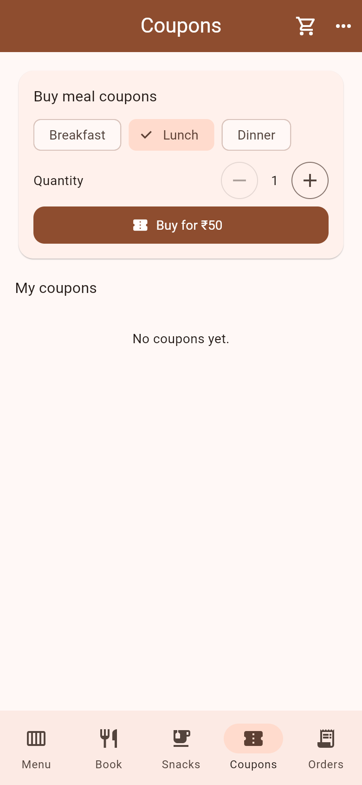<br/><sub><b>Coupons</b></sub></td>
    <td align="center">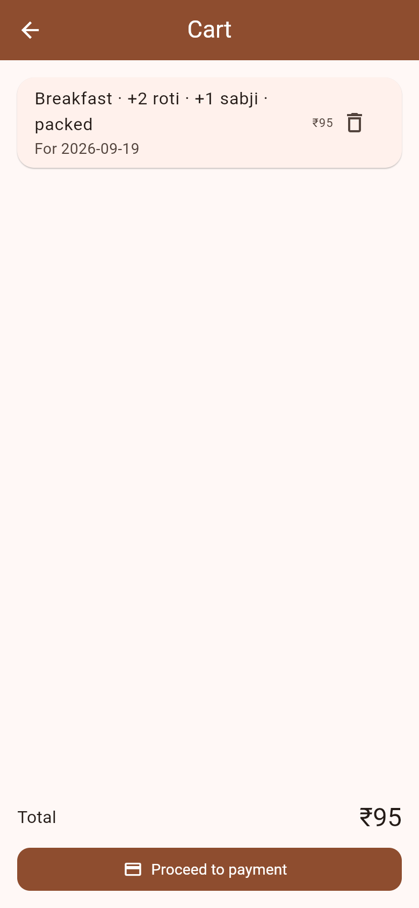<br/><sub><b>Cart</b></sub></td>
    <td align="center">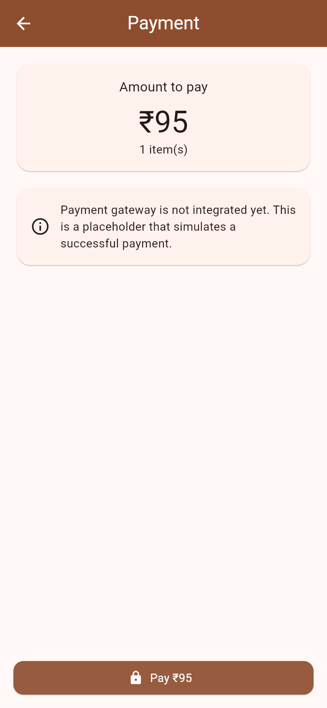<br/><sub><b>Payment</b></sub></td>
    <td align="center">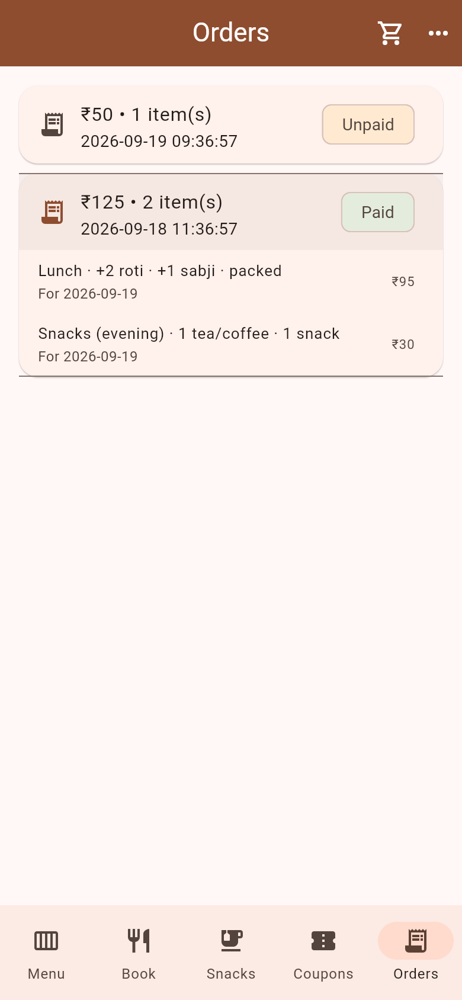<br/><sub><b>Order History</b></sub></td>
  </tr>
</table>

### Admin

<table>
  <tr>
    <td align="center"><br/><sub><b>Dashboard</b></sub></td>
    <td align="center">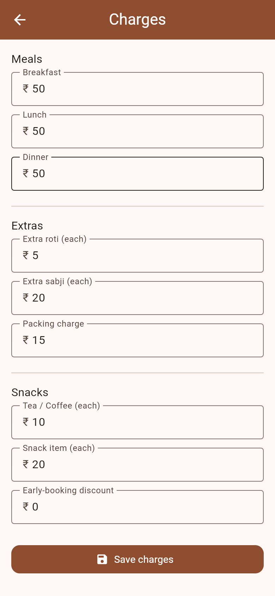<br/><sub><b>Charges Editor</b></sub></td>
    <td align="center">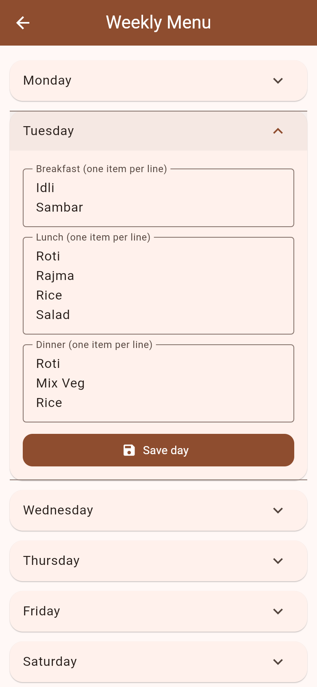<br/><sub><b>Menu Editor</b></sub></td>
    <td align="center">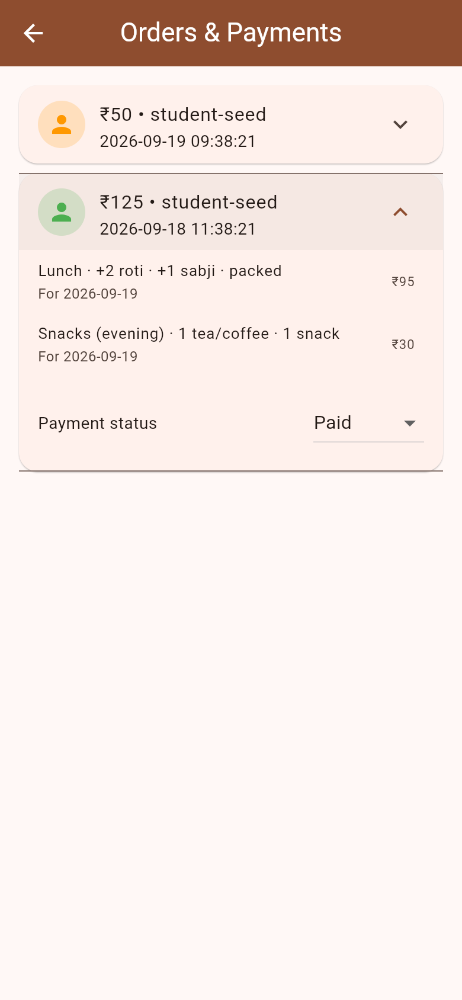<br/><sub><b>Orders & Payments</b></sub></td>
  </tr>
</table>

---

## ✨ Features

### 👨‍🎓 Student
- **Register / Login** with email & password (Firebase Auth)
- **Weekly menu** — breakfast, lunch and dinner for every day
- **Book meals** (Breakfast / Lunch / Dinner) for any date
- **Chargeable extras** — extra roti and extra sabji with quantity steppers
- **Packing** toggle with a flat packing charge
- **Snacks** — two configurable slots (morning / evening), **book‑now** or **early booking**, tea/coffee + snacks
- **Coupons** — buy prepaid meal passes and redeem later
- **Cart** with a live, itemized total
- **Payment** screen (stubbed — ready to swap in a real gateway)
- **Order history** with payment status

### 🛠️ Admin (single seeded account)
- **Dashboard** with one‑tap data seeding
- **Charges editor** — every price is editable and applies app‑wide instantly
- **Weekly menu editor** — edit items per day
- **Orders & Payments** — view all orders, set status (Unpaid / Paid / Refunded)
- **Snack slots** configuration

### 💰 Pricing (defaults — all admin‑editable)

| Item | Price |
|------|------:|
| Breakfast / Lunch / Dinner | ₹50 each |
| Extra roti | ₹5 each |
| Extra sabji | ₹20 each |
| Packing | ₹15 per meal |
| Tea / Coffee | ₹10 |
| Snack | ₹20 |

The pricing formula lives in **one** place (`PricingEngine`) and is unit‑tested. Money is stored as integer paise to avoid floating‑point errors.

---

## 🏗️ Architecture

```
Flutter (Android · iOS · Web)
        │  Riverpod (state/DI) · go_router (routing + role guard)
        ▼
Domain  →  entities · PricingEngine · repository interfaces
        ▼
Data    →  Firebase backend (prod)   |   In‑memory backend (demo/tests)
        ▼
Firebase  →  Auth · Cloud Firestore · Hosting
```

Everything depends on **repository interfaces**, so the exact same app runs against Firebase in production or an in‑memory backend for instant local demo and tests. Backend is chosen at build time with `--dart-define=BACKEND=firebase|memory` (default `memory`).

📄 Full design & flows: [`docs/architecture/ARCHITECTURE.md`](docs/architecture/ARCHITECTURE.md) · Implementation plan: [`docs/superpowers/plans/2026-09-19-canteen-app.md`](docs/superpowers/plans/2026-09-19-canteen-app.md)

---

## 🚀 Getting Started

### Run locally (zero setup — in‑memory demo)
```bash
flutter pub get
flutter run -d chrome                 # or an Android/iOS device
```
Default backend is `memory`; a demo admin (`admin@canteen.app` / `admin123`) and a demo student are seeded.

### Run against Firebase
```bash
flutter run -d chrome --dart-define=BACKEND=firebase
```
See [`docs/FIREBASE_GOLIVE.md`](docs/FIREBASE_GOLIVE.md) for one‑time project setup (rules, seeding, admin).

### Build
```bash
flutter build web    --dart-define=BACKEND=firebase   # → build/web
flutter build apk    --dart-define=BACKEND=firebase --split-per-abi
flutter build ipa    --dart-define=BACKEND=firebase   # needs Xcode on macOS
```

### Deploy the web app to Firebase Hosting
```bash
./deploy-web.sh       # builds + deploys → https://canteen-app-72a86.web.app
```
Details in [`docs/WEB_DEPLOY.md`](docs/WEB_DEPLOY.md).

### Test
```bash
flutter test          # 24 unit + widget tests
flutter analyze
```

---

## 🧱 Tech Stack

| Concern | Choice |
|---------|--------|
| Cross‑platform UI | **Flutter** |
| State / DI | **Riverpod** |
| Routing | **go_router** (role‑guarded) |
| Backend | **Firebase** — Auth, Firestore, Hosting |
| Local/demo backend | In‑memory repositories |
| Payments | `PaymentGateway` interface (+ stub) — drop‑in Razorpay/Stripe later |

## 📁 Project Structure
```
lib/
  core/        theme · money · router · shared widgets · contact
  domain/      entities · pricing engine · repository interfaces
  data/        firebase backend (prod) · memory backend (demo/tests)
  features/    auth · menu · booking · snacks · coupons · cart · payment · orders · admin
functions/     Cloud Functions (optional; not required on the free plan)
firestore.rules · firebase.json · docs/ · test/
```

---

## 🆘 Support

Facing an issue or error? Contact the admin: **Abhishek Gautam** · [gautam.abhishek7100@gmail.com](mailto:gautam.abhishek7100@gmail.com)

<div align="center"><sub>Built with Flutter & Firebase.</sub></div>
