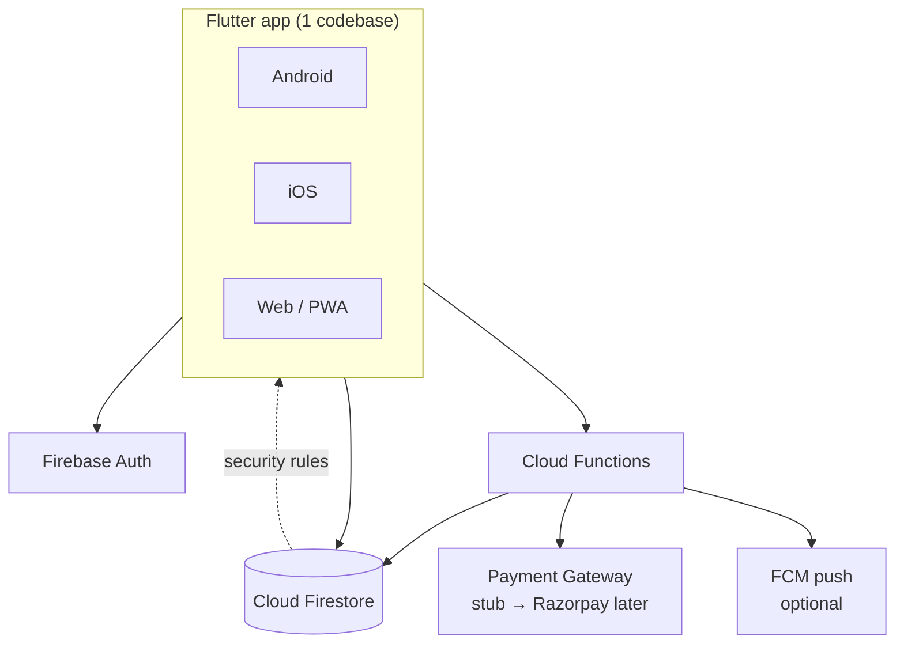
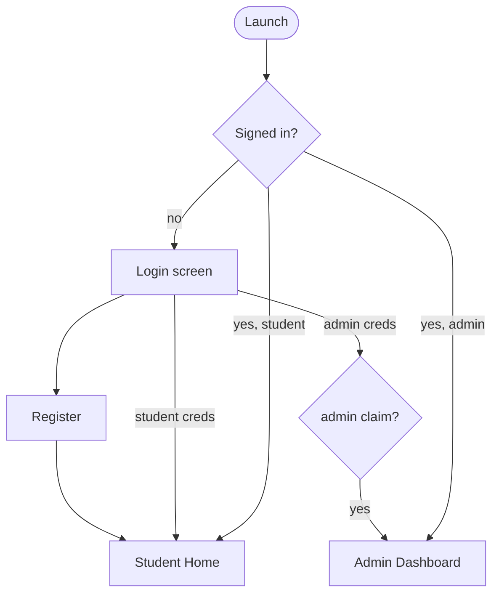
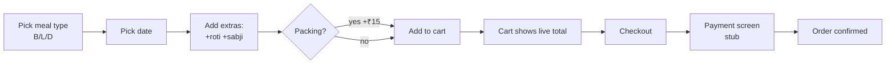
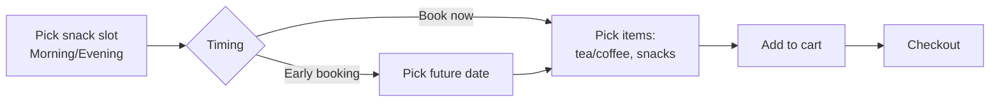
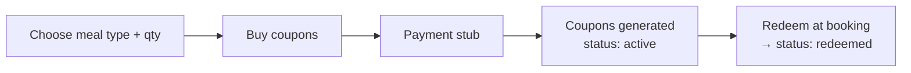
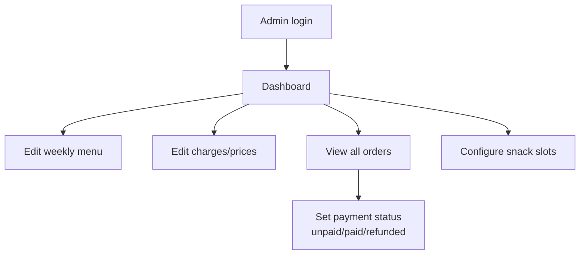

# Canteen App — Architecture & Application Flow

> Student canteen booking app for **Android, iOS, and Web** from a single **Flutter** codebase, backed by **Firebase**.

**Last updated:** 2026-09-19

---

## 1. Product Summary

A canteen ordering app for students. Students register/login, browse the weekly
menu, book **Breakfast / Lunch / Dinner**, add chargeable **extras** (extra roti,
extra sabji), optionally choose **packing**, book **snacks** (two snack slots,
tea/coffee + snacks, either "book now" or "early booking"), buy **coupons**
(prepaid meal passes), and pay (payment gateway stubbed for now). A pre-seeded
**Admin** manages the menu, charges, and payment status.

### 1.1 Roles

| Role | How created | Capabilities |
|------|-------------|--------------|
| **Student** | Self register (email + password) | Book meals/snacks, buy coupons, add extras, choose packing, view menu, view own orders, pay |
| **Admin** | Seeded by default on first deploy | Everything a student can do **plus**: edit weekly menu, edit all charges/prices, mark payment status (paid/unpaid/refunded), view all orders, manage snack slot config |

Roles are enforced by a Firestore `role` field **and** a Firebase Auth custom
claim (`admin: true`) so security rules can trust it server-side.

---

## 2. Pricing Rules (single source of truth)

All prices live in a Firestore document `config/pricing` and are **admin-editable**.
The values below are the seeded defaults.

| Item | Default price (₹) | Notes |
|------|------------------|-------|
| Breakfast | 50 | Base meal |
| Lunch | 50 | Base meal |
| Dinner | 50 | Base meal |
| Extra roti | 5 | Per unit, any quantity |
| Extra sabji | 20 | Per unit, any quantity |
| Packing | 15 | Per packed meal (flat) |
| Tea / Coffee (snack) | 10 | Per unit (default, admin editable) |
| Snacks item | 20 | Per unit (default, admin editable) |
| Early-booking snack discount | 0 | Optional; admin editable |

### 2.1 Price formula (canonical)

For a **meal order line**:

```
mealTotal = basePrice(mealType)
          + (extraRotiQty  × rotiPrice)
          + (extraSabjiQty × sabjiPrice)
          + (packed ? packingCharge : 0)
```

For a **snacks order line**:

```
snackTotal = (teaCoffeeQty × teaCoffeePrice)
           + (snackQty     × snackPrice)
           - (earlyBooking ? earlyBookingDiscount : 0)   // clamped ≥ 0
```

**Order total** = sum of all line totals. The formula is implemented once in a
pure `PricingEngine` (unit-tested) and reused on client (for preview) and in a
Cloud Function (authoritative, so clients can't tamper with totals).

---

## 3. Feature → Requirement Map

| Requirement | Where it lives |
|-------------|----------------|
| Register / Login | `auth` feature, Firebase Auth |
| Breakfast / Lunch / Dinner options | `booking` feature — meal type selector |
| Book breakfast/lunch/dinner | `booking` feature — order builder + checkout |
| Payment page (integrate later) | `payment` feature — stub screen behind `PaymentGateway` interface |
| Book coupons | `coupons` feature — prepaid passes |
| Extra roti (chargeable) | `booking` — extras stepper |
| Extra sabji (chargeable) | `booking` — extras stepper |
| Menu (weekly routine) | `menu` feature — read for students, edit for admin |
| Two snack times + book-now / early booking | `snacks` feature — slot + timing selector |
| Tea/Coffee + Snacks | `snacks` feature — item selector |
| Packing charge ₹15 | Pricing engine + booking toggle |
| Admin: update menu, payment status, charges | `admin` feature |
| Two login types (student + default admin) | `auth` + role claims |

---

## 4. System Architecture



- **Client:** Flutter, one codebase → Android/iOS/Web.
- **Auth:** Firebase Authentication (email/password). Admin gets a custom claim.
- **Database:** Cloud Firestore (real-time menu + orders).
- **Cloud Functions:** authoritative price calculation, order placement,
  payment-status transitions, admin bootstrap, setting the admin custom claim.
- **Payment:** a `PaymentGateway` interface with a `StubPaymentGateway` now;
  swap in Razorpay/Stripe later without touching UI.

### 4.1 Client architecture (layered + repository pattern)

```
Presentation (Widgets/Screens)  ──uses──▶  Controllers (Riverpod)
        │                                        │
        └────────── read view models ───────────┘
                             │
                             ▼
                    Domain (entities, PricingEngine, repository *interfaces*)
                             ▲
              ┌──────────────┴───────────────┐
              │                              │
   FirebaseRepository (prod)      InMemoryRepository (demo/tests)
```

Because everything depends on **repository interfaces**, the exact same app runs:
- against **Firebase** in production, and
- against an **in-memory mock** for local demo + unit/widget tests (so
  `flutter run` works instantly with zero Firebase setup).

The active repository is chosen at startup by a build flag
(`--dart-define=BACKEND=firebase|memory`, default `memory`).

### 4.2 Folder structure

```
lib/
  main.dart                     # entry, chooses backend, sets up Riverpod
  app.dart                      # MaterialApp, router, theme
  core/
    theme/                      # colors, typography
    router/                     # go_router config + role guards
    money.dart                  # ₹ formatting
  domain/
    entities/                   # User, MenuDay, Order, OrderLine, Coupon, Pricing...
    repositories/               # abstract AuthRepository, MenuRepository, ...
    pricing/pricing_engine.dart # pure pricing logic (unit-tested)
  data/
    firebase/                   # Firebase impls of the repositories
    memory/                     # in-memory impls (seed data)
    dto/                        # Firestore <-> entity mappers
  features/
    auth/                       # login, register, admin login
    menu/                       # weekly menu view + admin edit
    booking/                    # meal booking + extras + packing
    snacks/                     # snack slots + items + timing
    coupons/                    # buy + view coupons
    cart/                       # cart + checkout
    payment/                    # payment screen + gateway interface
    orders/                     # order history / status
    admin/                      # dashboard, charges, payment status, menu editor
  providers.dart                # Riverpod providers wiring repos to controllers
test/
  pricing_engine_test.dart
  ...
functions/                      # Cloud Functions (TypeScript)
firestore.rules                 # security rules
firebase.json / firestore.indexes.json
```

### 4.3 Tech choices

| Concern | Choice | Why |
|---------|--------|-----|
| Cross-platform | Flutter | One codebase → Android/iOS/Web |
| State mgmt | Riverpod | Testable, compile-safe DI, no BuildContext coupling |
| Routing | go_router | Declarative, deep-link + role-guard friendly |
| Backend | Firebase | Managed auth + realtime DB + functions, no server ops |
| Server logic | Cloud Functions (TS) | Authoritative pricing + secured writes |
| Payments | Interface + stub | Spec says integrate later; keep UI decoupled |

---

## 5. Data Model (Firestore)

```
users/{uid}
  name, email, role ("student"|"admin"), createdAt

config/pricing            (single doc, admin-editable)
  breakfast, lunch, dinner, roti, sabji, packing,
  teaCoffee, snack, earlyBookingDiscount, currency:"INR"

config/snackSlots         (admin-editable)
  slots: [{id:"morning", label:"Morning Snacks", time:"11:00"},
          {id:"evening", label:"Evening Snacks", time:"16:30"}]

menu/{weekday}            (mon..sun)
  breakfast:[String], lunch:[String], dinner:[String], updatedAt

orders/{orderId}
  uid, createdAt, status ("pending"|"confirmed"),
  paymentStatus ("unpaid"|"paid"|"refunded"),
  lines: [ OrderLine ], total
  # OrderLine (meal):  {kind:"meal", mealType, date, extraRoti, extraSabji, packed, lineTotal}
  # OrderLine (snack): {kind:"snack", slotId, date, teaCoffeeQty, snackQty, earlyBooking, lineTotal}

coupons/{couponId}
  uid, mealType, code, purchasedAt, expiresAt,
  status ("active"|"redeemed"|"expired"), redeemedOrderId?
```

### 5.1 Security rules (summary)

- `users/{uid}`: a user reads/writes only their own doc; `role` is not
  self-settable to `admin` (enforced by rule + it's really the custom claim
  that grants power).
- `config/*` and `menu/*`: **read** by any signed-in user; **write** only if
  `request.auth.token.admin == true`.
- `orders/*`: a student reads/writes only their own; admin reads all and may
  update `paymentStatus`. Totals are recomputed in a Function, not trusted from
  the client.
- `coupons/*`: owner reads own; created via Function.

---

## 6. Application Flows

### 6.1 Auth flow



There is **one** login screen. The account's role (custom claim) decides which
home is shown — no separate admin app. Admin account is seeded by default.

### 6.2 Meal booking flow (student)



### 6.3 Snacks flow



### 6.4 Coupons flow



### 6.5 Admin flow



---

## 7. Screen Inventory

**Student:** Login, Register, Home (tabs: Menu / Book / Snacks / Coupons / Orders),
Weekly Menu, Meal Booking, Snacks Booking, Cart, Payment, Order History, Profile.

**Admin:** Admin Dashboard, Menu Editor, Charges Editor, Orders & Payment
Manager, Snack Slot Config.

---

## 8. Payment (later integration)

`PaymentGateway` interface:

```dart
abstract class PaymentGateway {
  Future<PaymentResult> pay({required int amountPaise, required String orderId});
}
```

- **Now:** `StubPaymentGateway` → shows a mock "Pay ₹X" screen, returns success.
- **Later:** `RazorpayGateway` implements the same interface; Cloud Function
  creates the order + verifies signature. No UI changes needed.

---

## 9. Delivery Phases

1. **Foundation** — project scaffold, theme, router, entities, pricing engine (TDD), in-memory repo, seed data.
2. **Auth** — login/register, role routing, seeded admin (memory + Firebase).
3. **Menu** — weekly menu view.
4. **Booking** — meal builder + extras + packing + cart + live total.
5. **Snacks** — slots, timing, items.
6. **Coupons** — buy + list + redeem.
7. **Payment** — stub gateway + checkout.
8. **Orders** — history + status.
9. **Admin** — menu editor, charges editor, payment-status manager, snack config.
10. **Firebase wiring** — Firestore schema, rules, Cloud Functions, admin bootstrap.
11. **Platform builds** — web build here; Android/iOS build docs (need Xcode/Android Studio).

The full task-by-task breakdown is in
`docs/superpowers/plans/2026-09-19-canteen-app.md`.
